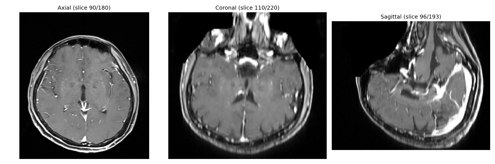
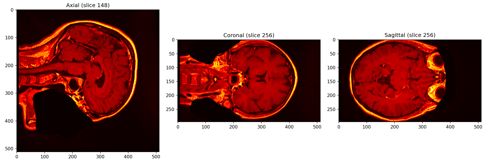
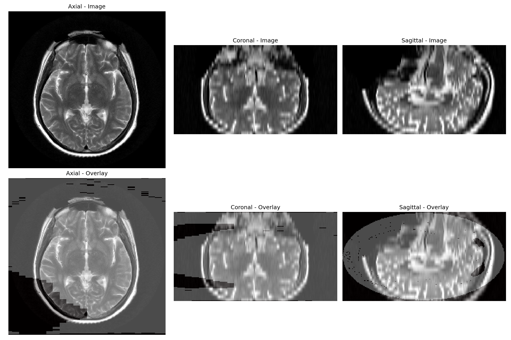

# CMPE 295A - Intracranial Aneurysm Detection

Deep learning-based detection of intracranial aneurysms using 3D nnU-Net segmentation.

## Team
- Venkat Gowtham Bhupalam
- Nicolas Guerrero
- Dina Liao

## Project Overview

Intracranial aneurysms affect approximately 3.2% of the global population. This project develops an automated detection system using deep learning to assist radiologists in identifying aneurysms from brain imaging data.

### Approach
- **Architecture:** Modified nnU-Net with SE blocks and TransUNet-style decoder
- **Dataset:** RSNA Intracranial Aneurysm Detection Challenge (4,348 patients)
- **Modality:** MR Angiography (TOF-MRA)

## Repository Structure
```
├── preprocessing.py          # Data preprocessing pipeline
├── dataset.json              # nnU-Net dataset configuration
├── *.png                     # Visualization outputs
└── notebooks/                # Jupyter notebooks
```

## Preprocessing Pipeline
```
Raw DICOM → Load Series → Normalize Intensity → Resample (1mm³) → NIfTI Export
```

### Key Steps:
1. **DICOM Loading** - Load 3D volume from .dcm files
2. **Intensity Normalization** - Percentile clipping [1%, 99%]
3. **Resampling** - Isotropic 1.0mm spacing
4. **Format Conversion** - NIfTI (.nii.gz) for nnU-Net

## Sample Results

| Metric | Original | Processed |
|--------|----------|-----------|
| Shape | (120, 448, 392) | (180, 220, 193) |
| Spacing | (1.5, 0.49, 0.49) mm | (1.0, 1.0, 1.0) mm |
| Intensity | [0, 2053] | [0.0, 1.0] |

## Visualizations

### Preprocessed MRI Slices


### Vessel Segmentation


### nnU-Net Data with Labels


## Usage
```python
from preprocessing import AneurysmPreprocessor

# Initialize preprocessor
preprocessor = AneurysmPreprocessor(target_spacing=(1.0, 1.0, 1.0))

# Process a DICOM series
volume, metadata = preprocessor.preprocess('/path/to/dicom/series')
```

## Dependencies

- Python 3.10+
- PyTorch
- MONAI
- nnU-Net v2
- pydicom
- nibabel
- SimpleITK

## Next Steps (295B)

- [ ] Full dataset preprocessing
- [ ] nnU-Net baseline training
- [ ] SE-ResNet encoder blocks
- [ ] TransUNet-style decoder
- [ ] Auxiliary lesion detection head
- [ ] Evaluation metrics (Dice, Sensitivity, FP/case)
- [ ] Prototype clinical viewer

## References

1. Isensee, F., et al. "nnU-Net: A self-configuring method for deep learning-based biomedical image segmentation." Nature Methods, 2021.
2. Çiçek, Ö., et al. "3D U-Net: Learning Dense Volumetric Segmentation from Sparse Annotation." MICCAI, 2016.
3. RSNA Intracranial Aneurysm Detection Challenge, 2025.
